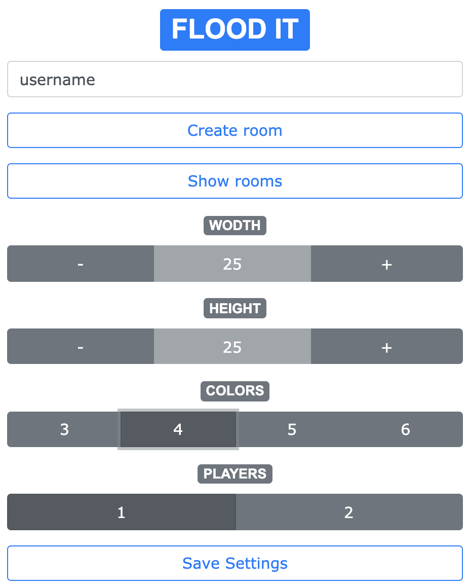
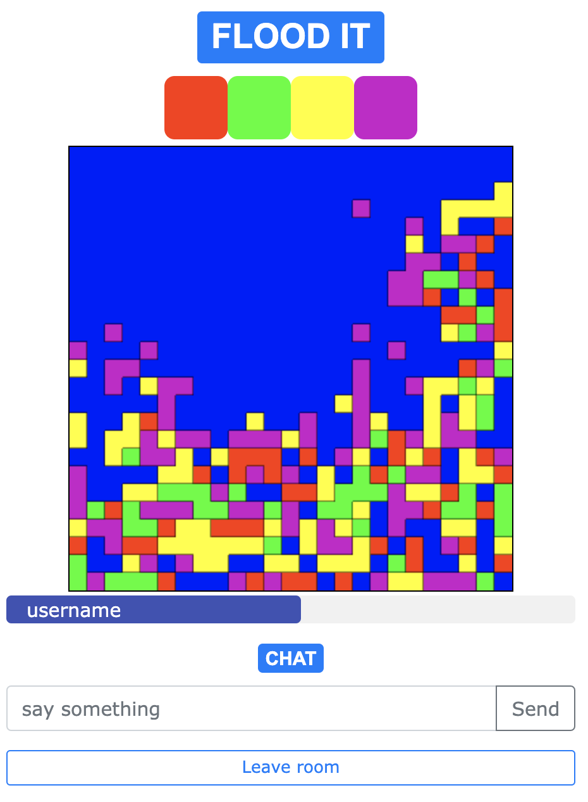

# Flood It

Simple flood it real-time multiplayer game created with react.

To run in the development mode:
- For backend see [https://github.com/eliastuomi/floodit_backend](https://github.com/eliastuomi/floodit_backend)
- npm install
- change socketIOClient() to socketIOClient(SOCKET_SERVER_URL) in src/components/Join.js & src/components/Room.js
- npm start
- Open [http://localhost:3000](http://localhost:3000) to view it in the browser.

## Author

* **Elias Tuomi**
